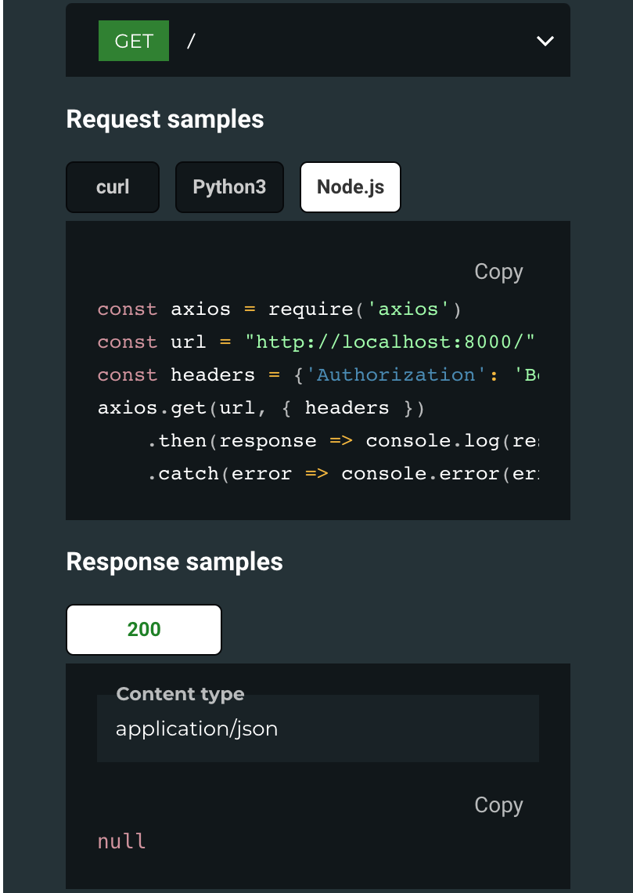
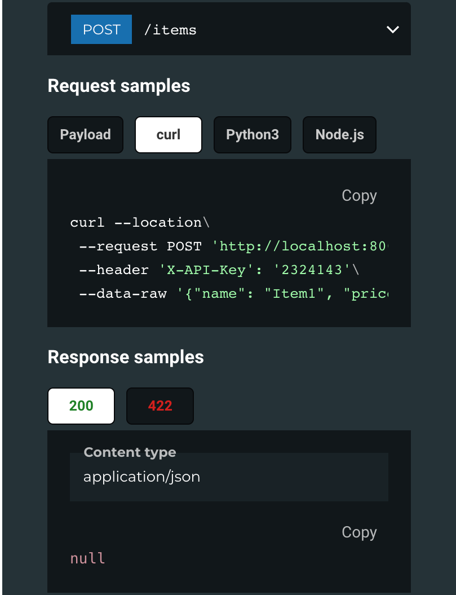

# Code Sample Docs

A code sample generator for fastapi endpoint extending on OpenAPI.

## Installation

```bash
pip install fastapi-code-samples
```

## Usage

```python
from fastapi import FastAPI

from fastapi_code_samples.CustomAuth import CustomAuth
from fastapi_code_samples.SampleGenerator import SampleGenerator
from pydantic import BaseModel

app = FastAPI()


class ItemCreate(BaseModel):
    name: str
    price: float
    is_offer: bool = None

    class Config:
        json_schema_extra = {
            "example": {
                "name": "Item1",
                "price": 100,
                "is_offer": True,
            }
        }


@app.get("/")
def read_root():
    return {"Hello": "World"}


@app.post("/items")
def create_item(data: ItemCreate):
    return {"item": data.dict()}


auth_config = CustomAuth(
    header='Authorization',
    prefix='Bearer',
    sample_token='1234'
)
sample_object = SampleGenerator(app, auth_config=auth_config)

app.openapi_schema = sample_object.custom_openapi()
```

# Examples

Here are some examples of the generated code samples.<br><br>
 <br><br>
